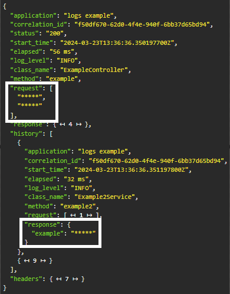

# Demo Logs AOP


> Esse projeto tem o intuito de demonstrar como gerar logs de forma automática e efetiva, para aplicações
> java com Spring Boot. O projeto contém logs com criptografia de dados. 
## Confira
Você pode conferir explicações do funcionamento aqui
#### PARTE I - (branch parte_1) 
[Debugging de aplicações Spring Boot em produção](https://medium.com/@sheywesk/debugging-de-aplica%C3%A7%C3%B5es-spring-boot-em-produ%C3%A7%C3%A3o-dacf6cf01be3)

#### PARTE II - (branch parte_2) 
[Criptografia de logs em 3 passos | Spring Boot | logger | java](https://medium.com/@sheywesk/criptografia-de-logs-com-3-passos-spring-boot-aop-java-b36fe4d13786)

## 💻 Pré-requisitos

- java 21 
- maven 3.8

## ☕ Usando

Clone o projeto 

```
git clone https://github.com/sheywesk/demo-logs-aop.git
```
Execute o maven na raíz do pom.xml
```
mvn install
```
E rode o projeto na sua IDE

## Features

- [x] logs automáticos
- [x] criptografia de logs
- [x] histórico de execuções de todos os métodos
- [ ] sanitização de stacktrace ( em breve )
